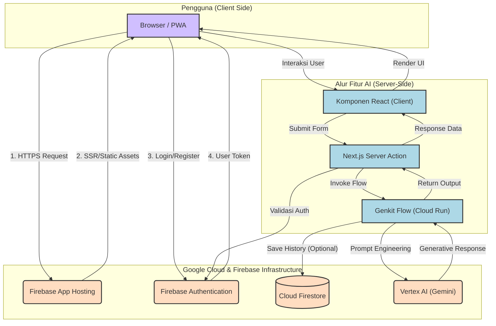
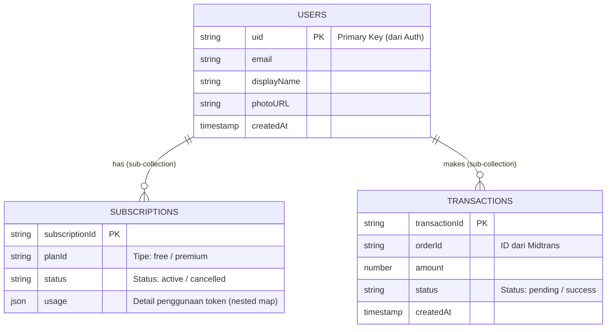
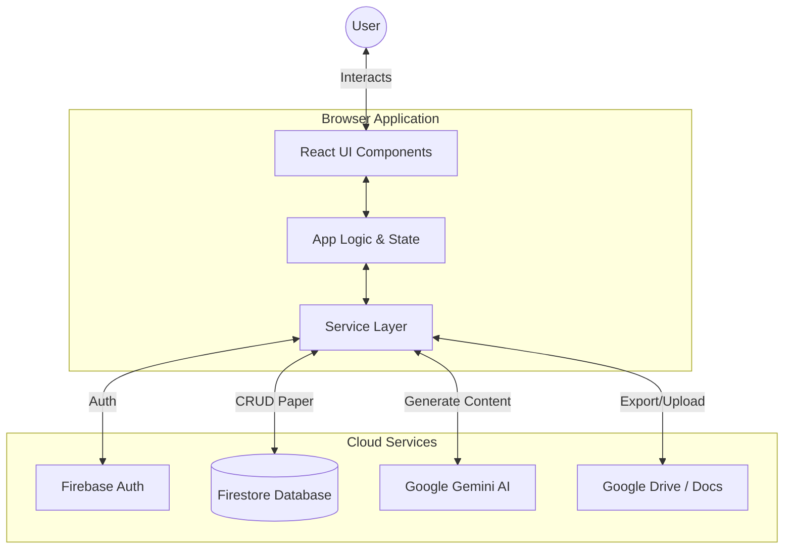
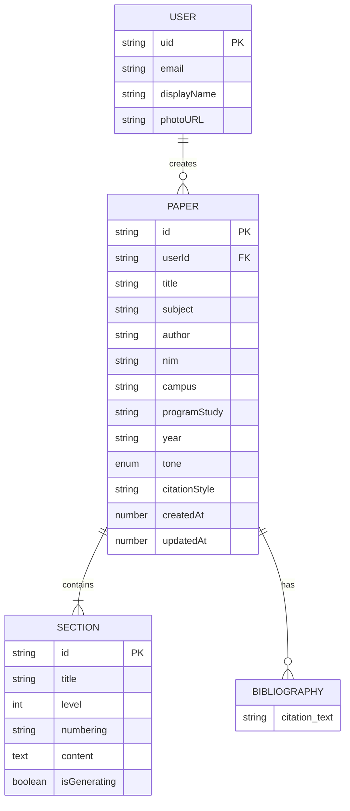
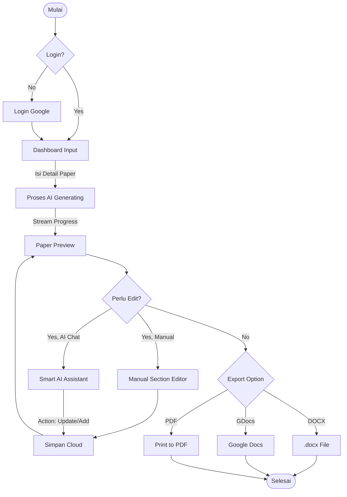
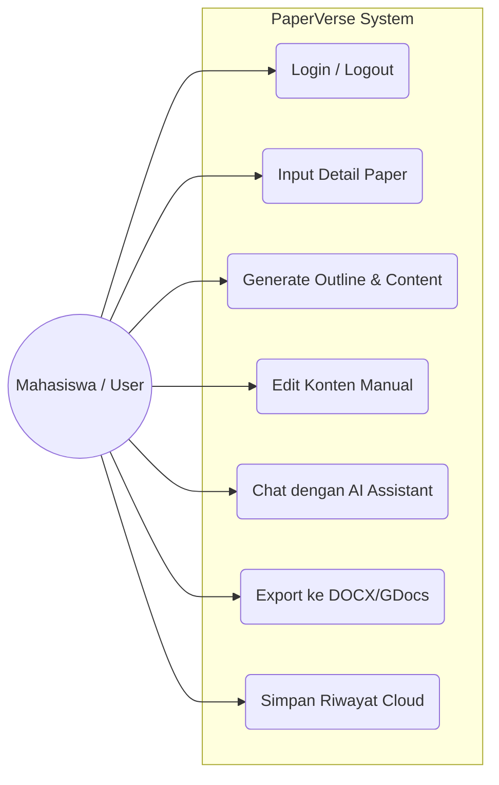
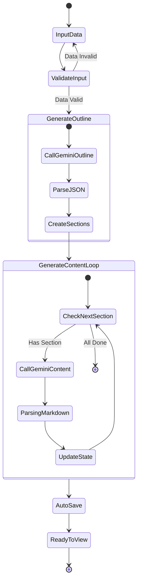
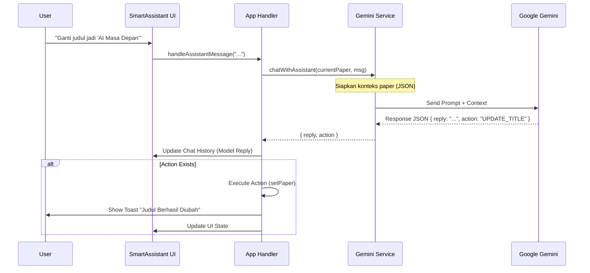
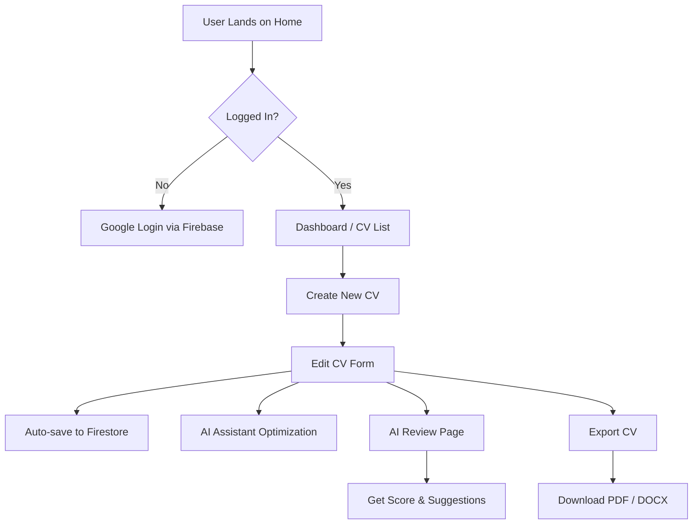

# Learniverse: Asisten Belajar Cerdas Bertenaga AI

Selamat datang di Learniverse, sebuah platform inovatif yang dirancang untuk memberdayakan siswa dan akademisi dengan seperangkat alat canggih berbasis kecerdasan buatan (AI). Misi kami adalah untuk mengatasi berbagai tantangan akademis, mempercepat proses belajar, dan membantu pengguna mencapai potensi penuh mereka.

Aplikasi ini dibangun oleh **Revan (Eka Revandi)**, seorang Cloud Architect dan Software Engineer yang bersemangat dalam menggabungkan teknologi cloud dan AI untuk menciptakan solusi pendidikan yang transformatif.

## ✨ Fitur Unggulan

Learniverse dilengkapi dengan berbagai fitur cerdas yang dirancang khusus untuk mendukung berbagai kebutuhan akademis, mulai dari tahap awal pencarian ide hingga penyelesaian tugas akhir.

### 🧠 Katalisator Ide & Kreativitas

- **Brainstorm Topik**: Menghasilkan ide sub-topik yang menarik dari sebuah tema umum.
- **Kerangka Presentasi**: Mengubah judul menjadi kerangka slide yang logis dan terstruktur.
- **Pencari Analogi**: Menyederhanakan konsep teknis yang rumit menjadi lebih mudah dipahami.
- **Roadmap Belajar**: Membuat roadmap belajar terstruktur untuk menguasai keterampilan baru.
- **Pembuat Pertanyaan**: Menghasilkan daftar pertanyaan dari materi pelajaran untuk kuis atau diskusi.

### 📚 Asisten Riset & Penulisan

- **Kerangka Penelitian**: Membuat draf kerangka skripsi atau tesis sesuai standar akademis.
- **Pencari Referensi Cerdas**: Memberikan rekomendasi kata kunci alternatif untuk riset literatur.
- **Parafrase Akademik**: Menyusun ulang kalimat untuk menghindari plagiarisme dengan tetap menjaga makna.
- **Peringkas Jurnal & Dokumen**: Meringkas artikel atau dokumen (PDF/Word) ke dalam Bahasa Indonesia.
- **Jawaban Cepat**: Mengunggah dokumen soal (PDF/JPG) dan membiarkan AI menjawabnya.

### 🎓 Asisten Profesional & Personal

- **Tutor AI**: Bertanya jawab dengan AI berdasarkan konteks materi kuliah yang diunggah.
- **CV Reviewer**: Mendapatkan ulasan, skor, dan saran perbaikan untuk CV dari AI yang bertindak sebagai HR.
- **Code Review**: Menjalankan kode (JavaScript), dan jika terjadi error, AI akan menjelaskan masalah serta solusinya.

## 🚀 Tumpukan Teknologi (Tech Stack)

Aplikasi ini dibangun di atas tumpukan teknologi modern yang berfokus pada kinerja, skalabilitas, dan pengalaman pengembang.

- **Framework Utama**: **Next.js (App Router)** & **React** - Untuk membangun antarmuka pengguna yang cepat dan responsif dengan Server-Side Rendering (SSR) dan Static Site Generation (SSG).
- **Bahasa**: **TypeScript** - Untuk memastikan keamanan tipe dan meningkatkan kualitas kode.
- **Styling**: **Tailwind CSS** & **Shadcn/UI** - Untuk desain yang konsisten, modern, dan dapat disesuaikan.
- **Manajemen Form**: **React Hook Form** & **Zod** - Untuk validasi skema dan formulir yang andal.
- **AI & Generative Layer**: **Google Genkit** - Sebagai orkestrator backend yang merutekan permintaan ke model AI yang sesuai.
- **Model AI**: **Google Gemini (via Vertex AI)** - Sebagai otak di balik semua fitur generatif.
- **Database**: **Cloud Firestore** - Database NoSQL yang serverless, skalabel, dan real-time untuk menyimpan data pengguna, langganan, dan transaksi.
- **Autentikasi**: **Firebase Authentication** - Untuk mengelola login pengguna yang aman melalui email/password dan Google.
- **Infrastruktur & Hosting**: **Firebase App Hosting** - Platform terkelola penuh yang secara otomatis membangun dan men-deploy aplikasi Next.js menggunakan infrastruktur Google Cloud (seperti Cloud Run dan Cloud Build).
- **Gerbang Pembayaran**: **Midtrans** - Untuk memproses pembayaran langganan dengan aman.
- **Analitik & Performa**: **Vercel Analytics** & **Speed Insights** - Untuk memantau lalu lintas dan kinerja aplikasi.

## 🏗️ Arsitektur Aplikasi

Learniverse dirancang dengan **Arsitektur Aplikasi Web Serverless**. Arsitektur ini tidak bergantung pada server tradisional yang berjalan terus-menerus. Sebaliknya, ia memanfaatkan layanan terkelola dari Google Cloud yang hanya aktif saat ada permintaan, membuatnya sangat efisien, skalabel, dan hemat biaya.



### Penjelasan Alur Arsitektur

1. **Hosting & Pengguna**: Aplikasi Next.js di-hosting menggunakan **Firebase App Hosting**. Saat pengguna mengakses web, App Hosting akan menyajikan file statis dan halaman yang di-render di server.
2. **Autentikasi**: Pengguna login melalui **Firebase Authentication**. Setelah berhasil, klien menerima token (ID Token) yang digunakan untuk memverifikasi identitas pada permintaan selanjutnya.
3. **Eksekusi Fitur (Client-Side)**: Pengguna berinteraksi dengan komponen React, misalnya mengisi formulir untuk fitur "Peringkas Jurnal".
4. **Server Actions**: Saat formulir dikirim, sebuah **Next.js Server Action** dipanggil. Ini adalah fungsi yang berjalan aman di sisi server. Server Action ini menerima input dari pengguna dan bertindak sebagai jembatan ke lapisan AI.
5. **Genkit Flows**: Server Action memanggil **Genkit Flow** yang relevan (terletak di `/src/ai/flows`). Flow ini berisi logika spesifik, termasuk *prompt engineering* yang telah dirancang untuk model Gemini. Flow ini berjalan di lingkungan serverless (Cloud Run) yang dikelola oleh Firebase App Hosting.
6. **Panggilan Model AI**: Genkit Flow mengirimkan *prompt* yang sudah diproses ke model **Gemini** melalui **Google AI Platform (Vertex AI)**.
7. **Database**: Jika diperlukan (misalnya saat memeriksa status langganan atau menyimpan riwayat), Genkit Flow atau Server Action dapat berinteraksi langsung dengan **Cloud Firestore**. Aturan Keamanan (Security Rules) Firestore memastikan bahwa setiap pengguna hanya dapat mengakses datanya sendiri.
8. **Respons**: Hasil dari model Gemini dikembalikan melalui alur yang sama (Genkit Flow -> Server Action -> Komponen React) dan akhirnya ditampilkan kepada pengguna.

Pola ini memastikan bahwa:

- **Kunci API Aman**: Kunci API untuk layanan Google AI dan Midtrans tidak pernah terekspos di browser.
- **Skalabilitas**: Setiap bagian dari arsitektur (hosting, fungsi AI, database) dapat menskalakan secara independen sesuai permintaan.
- **Modularitas**: Setiap fitur AI terenkapsulasi dalam Genkit Flow-nya sendiri, membuatnya mudah dikelola dan diperbarui.

## 🗃️ Model & Struktur Database (Firestore)

Database aplikasi menggunakan Cloud Firestore dengan struktur data yang berpusat pada pengguna (user-centric). Semua data terkait pengguna disimpan dalam sub-koleksi di bawah dokumen pengguna tersebut.

```
### Model & Struktur Database (Firestore)

Database aplikasi menggunakan Cloud Firestore dengan struktur data yang berpusat pada pengguna (*user-centric*). Data langganan dan transaksi disimpan sebagai **sub-koleksi** di bawah dokumen pengguna.



flowchart TD
    Start([Mulai]) --> Login{Sudah Login?}

    Login -- Tidak --> AuthPage[Halaman Login/Register]
    AuthPage --> AuthProcess[Proses Autentikasi Firebase]
    AuthProcess --> CheckStatus{Berhasil?}
    CheckStatus -- Tidak --> AuthPage
    CheckStatus -- Ya --> Dashboard[Dashboard Utama]
    
    Login -- Ya --> Dashboard
    
    Dashboard --> SelectFeature[Pilih Fitur AI]
    
    subgraph Features [Fitur Learniverse]
        Direction1[Brainstorming]
        Direction2[Peringkas Jurnal]
        Direction3[Tutor AI]
        Direction4[CV Review]
    end
    
    SelectFeature --> Features
    Features --> InputData[/Input Data / Upload Dokumen/]
    InputData --> ProcessAI[Proses Genkit & Gemini]
    ProcessAI --> Output[/Tampilkan Hasil/]
    
    Output --> SaveOption{Simpan?}
    SaveOption -- Ya --> SaveDB[(Simpan ke Firestore)]
    SaveDB --> End([Selesai])
    SaveOption -- Tidak --> End

    usecaseDiagram
    actor "Mahasiswa / User" as User
    actor "Sistem AI (Gemini)" as AI
    actor "Payment Gateway" as Midtrans

    package "Learniverse App" {
        usecase "Login & Registrasi" as UC1
        usecase "Brainstorming Ide" as UC2
        usecase "Meringkas Dokumen" as UC3
        usecase "Parafrase Teks" as UC4
        usecase "Konsultasi Tutor AI" as UC5
        usecase "Review CV" as UC6
        usecase "Kelola Langganan" as UC7
    }

    User --> UC1
    User --> UC2
    User --> UC3
    User --> UC4
    User --> UC5
    User --> UC6
    User --> UC7

    UC2 .> AI : include
    UC3 .> AI : include
    UC4 .> AI : include
    UC5 .> AI : include
    UC6 .> AI : include
    
    UC7 --> Midtrans : payment

    sequenceDiagram
    participant User as Pengguna
    participant FE as Frontend (Next.js)
    participant BE as Server Action
    participant GK as Genkit Flow
    participant AI as Vertex AI (Gemini)

    User->>FE: Upload File PDF/Teks
    FE->>BE: Kirim Data (POST)
    activate BE
    BE->>BE: Validasi Input & Auth
    BE->>GK: Panggil Flow: summarizeFlow
    activate GK
    GK->>GK: Pre-processing & Prompting
    GK->>AI: Generate Content
    activate AI
    AI-->>GK: Hasil Ringkasan
    deactivate AI
    GK-->>BE: Return Data Terstruktur
    deactivate GK
    BE-->>FE: Response JSON
    deactivate BE
    FE-->>User: Tampilkan Hasil Ringkasan

Aturan Keamanan Firestore diterapkan secara ketat untuk memastikan bahwa pengguna hanya dapat membaca dan menulis datanya sendiri, menegakkan privasi dan keamanan data.

Terima kasih telah menggunakan Learniverse! Kami berharap aplikasi ini dapat menjadi mitra setia dalam perjalanan akademis Anda.

=================================================================

<div align="center">
  <h1>PaperVerse - Academic AI Assistant</h1>
  <p><strong>PaperVerse</strong> adalah aplikasi berbasis web yang memanfaatkan teknologi Generative AI untuk membantu mahasiswa dan akademisi dalam menyusun, mengembangkan, dan memformat makalah ilmiah secara profesional, cepat, dan terstruktur.</p>
</div>

---

## 🚀 Fitur Utama

- **AI-Powered Generation**: Menyusun seluruh struktur dan konten makalah (Bab, Sub-bab) secara otomatis menggunakan Google Gemini AI.
- **Smart Assistant**: Chatbot pintar yang bisa diperintah untuk mengubah judul, menambah bab, atau merevisi konten secara langsung.
- **Auto-Citation**: Manajemen sitasi otomatis dengan berbagai gaya (APA, MLA, Custom).
- **Manual Editor "Word-like"**: Editor teks terintegrasi yang *seamless* untuk perbaikan manual kapan saja.
- **Cloud Sync**: Penyimpanan otomatis ke Firebase Cloud (Firestore) agar data tidak hilang.
- **Multi-Format Export**: Unduh hasil dalam format `.docx` (Microsoft Word) atau simpan langsung ke Google Docs.

## 🛠 Tech Stack

### Frontend Application

- **Language**: TypeScript
- **Framework**: React.js (Vite)
- **Styling**: Tailwind CSS (Vanila CSS untuk kustomisasi spesifik)
- **Icons**: FontAwesome

### Cloud & Backend Services

- **Database**: Google Firebase Firestore (NoSQL)
- **Authentication**: Google Firebase Auth
- **AI Engine**: Google Gemini API (Model: `gemini-3-flash-preview` & `gemini-3-pro-preview`)
- **Storage/Docs**: Google Drive API & Google Docs API

### Libraries

- `docx`: Untuk generasi file Word di sisi klien.
- `react-toastify`: Notifikasi UI.
- `file-saver`: Manajemen unduhan file.
- `google-auth-library`: Autentikasi layanan Google.

---

## 🏗 Architecture Overview

Arsitektur PaperVerse menggunakan pendekatan **Serverless Client-Side Rendering**. Aplikasi React berjalan di browser pengguna dan berkomunikasi langsung dengan layanan cloud (Firebase & Google Cloud Platform) melalui API, tanpa backend server tradisional.



---

## 📊 Entity Relationship Diagram (ERD)

Meskipun menggunakan NoSQL (Firestore), struktur data logis aplikasi ini direpresentasikan sebagai berikut. Entitas utamanya adalah `User` dan `Paper`.



---

## 🔄 Application Flow & Diagrams

### 1. High-Level Flowchart

Alur utama pengguna dari mulai membuka aplikasi hingga mendapatkan makalah jadi.



### 2. Use Case Diagram

Fungsionalitas yang tersedia bagi User (Actor).



### 3. Activity Diagram: Generate Paper

Detail aktivitas saat user melakukan generate makalah.



### 4. Sequence Diagram: Smart Assistant Flow

Interaksi antara User, Komponen UI, Logic App, dan Gemini Service saat menggunakan Chatbot.



---

## 📦 Installation & Run Locally

**Prerequisites:** Node.js v18+

1. **Clone Repository**

   ```bash
   git clone https://github.com/username/paperverse.git
   cd paperverse
   ```

2. **Install Dependencies**

   ```bash
   npm install
   ```

3. **Configure Environment**
   Buat file `.env` di root folder dan isi:

   ```env
   VITE_API_KEY=your_google_gemini_api_key
   VITE_FBASE_API_KEY=your_firebase_api_key
   VITE_FBASE_AUTH_DOMAIN=...
   VITE_FBASE_PROJECT_ID=...
   VITE_GOOGLE_CLIENT_ID=...
   ```

4. **Run Development Server**

   ```bash
   npm run dev
   ```

   Buka `http://localhost:5173` di browser.

---

<div align="center">
  <p>Built with ❤️ by <strong>Eka Revandi</strong></p>
  <p><em>Cloud and Software Engineer</em></p>
</div>

=======================================================

# When Yahhh Kerja (Hireverse) 🚀

**When Yahhh Kerja** (juga dikenal sebagai **Hireverse**) adalah platform pembuatan CV berbasis AI yang dirancang khusus untuk mempermudah pencari kerja dalam membuat CV profesional, ATS-friendly, dan berimpact tinggi dalam hitungan menit.


## 🎯 Tujuan Aplikasi

Aplikasi ini bertujuan untuk mendemokratisasi akses ke bimbingan karir berkualitas tinggi. Dengan memanfaatkan teknologi LLM (Large Language Model), aplikasi ini membantu pengguna mengoptimalkan deskripsi pengalaman kerja, ringkasan profesional, hingga menyesuaikan CV dengan kriteria lowongan kerja tertentu (Job Tailoring).

## ✨ Fitur Utama

- **🚀 AI CV Builder**: Buat CV dari nol dengan bantuan asisten AI yang memberikan saran konten secara real-time.
- **🔍 AI CV Review**: Analisis CV Anda untuk mendapatkan skor, kekuatan, kelemahan, dan tips perbaikan instan.
- **🎯 Job Tailoring**: Sesuaikan CV Anda secara otomatis berdasarkan deskripsi pekerjaan yang dilamar untuk meningkatkan kecocokan ATS.
- **☁️ Cloud Sync (Real-time)**: Simpan progres pembuatan CV secara otomatis ke cloud. Akses dari mana saja tanpa takut kehilangan data.
- **📄 Multi-format Export**: Download CV dalam format PDF yang rapi atau file DOCX yang bisa diedit kembali.
- **🛡️ Secure Auth**: Login aman menggunakan Google Authentication melalui integrasi Firebase.
- **🎨 Modern UI**: Desain antarmuka yang energetik dengan gaya "Sticker/Brutalist" yang unik dan responsif.

## 🏗️ Arsitektur Sistem

Aplikasi ini menggunakan arsitektur **Modern Serverless Web App**:

### 1. Frontend Layer

- **React 19**: Library inti untuk membangun antarmuka deklaratif.
- **Vite**: Build tool super cepat untuk pengembangan dan bundling.
- **Tailwind CSS 4**: Framework CSS untuk styling cepat dan konsisten dengan sistem desain modern.
- **Framer Motion**: Engine animasi untuk transisi UI yang halus dan micro-interactions.
- **React Router 7**: Manajemen navigasi dan routing antar halaman.

### 2. Service Layer (AI & Backend)

- **Google Gemini API**: Menggunakan SDK `@google/genai` untuk tugas-tugas cerdas seperti optimasi teks dan analisis CV.
- **Firebase Authentication**: Menangani identitas pengguna secara aman.
- **Firebase Firestore**: Database NoSQL real-time untuk sinkronisasi data CV antar perangkat secara instan.
- **Vercel Blob Storage**: Digunakan untuk penyimpanan aset media seperti foto profil secara efisien.

### 3. Export Engine

- **jsPDF**: Untuk rendering layout CV yang presisi ke format PDF.
- **docx**: Untuk pembuatan dokumen Word (.docx) secara dinamis di sisi klien.

## 🔄 Flow Sistem



1. **Autentikasi**: Pengguna masuk menggunakan akun Google. State user dikelola oleh Firebase Auth.
2. **Dashboard**: Pengguna melihat daftar CV yang pernah dibuat. Data ditarik dari Firestore dengan listener real-time.
3. **Editor**: Pengguna mengisi data personal, pengalaman, pendidikan, dll. Setiap perubahan akan disimpan secara otomatis ke Firestore menggunakan mekanisme *debounce*.
4. **Optimasi AI**: Pengguna bisa mengklik tombol AI untuk mengoptimalkan bahasa di setiap section. Request dikirim ke Gemini AI dengan instruksi khusus agar ramah ATS.
5. **Review & Export**: Setelah selesai, pengguna bisa mereview skor CV mereka atau langsung mendownloadnya dalam format yang diinginkan.

## 🛠️ Pengembangan Lokal

### Prasyarat

- Node.js (versi terbaru direkomendasikan)
- Akun Firebase (untuk database & auth)
- API Key Google Gemini (tersedia di Google AI Studio)

### Langkah Setup

1. **Clone repository**:

   ```bash
   git clone https://github.com/your-username/cv-maker.git
   ```

2. **Install dependensi**:

   ```bash
   npm install
   ```

3. **Konfigurasi Environment**:
   Buat file `.env.local` di root folder dan isi dengan variabel berikut:

   ```env
   VITE_FIREBASE_API_KEY=your_key
   VITE_FIREBASE_AUTH_DOMAIN=your_domain
   VITE_FIREBASE_PROJECT_ID=your_id
   VITE_FIREBASE_STORAGE_BUCKET=your_bucket
   VITE_FIREBASE_MESSAGING_SENDER_ID=your_id
   VITE_FIREBASE_APP_ID=your_id
   VITE_GEMINI_API_KEY=your_gemini_key
   ```

4. **Jalankan aplikasi**:

   ```bash
   npm run dev
   ```

## 📄 Lisensi

Project ini dibuat untuk mempermudah pencari kerja. Silakan gunakan dengan bijak.

---
Dibuat dengan ❤️ untuk masa depan karir yang lebih baik.
